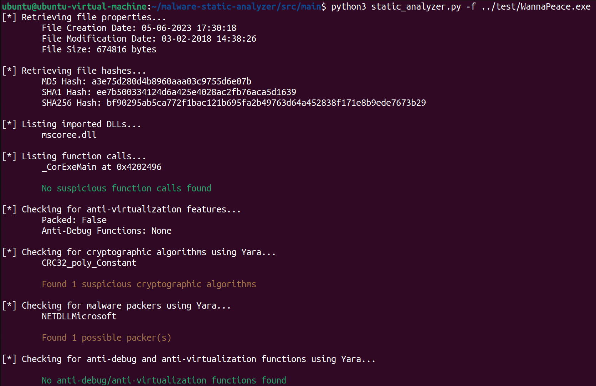

# Malware Static Analyzer


## Description
Static_analyzer.py analyzes multiple components of a portable executable file including headers, imported DLLs, function
calls, etc. Many current static analysis tools require a learning curve or a multitude of plugins to be able to use it
for general analysis. Static_analyzer is a simple, reliable, and fast analysis tool that aids in the recognition of
malicious executable files.

## Getting Started

### Dependencies
* Python3
* Colorama 
* Termcolor
* Peutils 
* Pefile 
* Yara

### Installing
```
# Clone this repository
$ git clone https://github.com/sea7321/malware-static-analyzer.git

# Go into the repository
$ cd malware-static-analyzer

# Install dependencies
$ pip install -r requirements.txt
```

### Obtaining malware samples
```
# Clone theZoo repository
$ git clone https://github.com/ytisf/theZoo.git

# Go into the malware binaries folder
$ cd theZoo/malware/Binaries

# Extract desired malware samples
$ unzip <file.zip> -d <destination_folder>
```

### List of extracted folders tested
> * W32.Elkern.B 
> * W32.HLLP.Hantaner.A 
> * W32.Nimda.E 
> * W32.Slammer
> * W32.Swen 
> * Win32.AgentTesla
> * Win32.Alina.3.4.B 
> * Win32.DarkTequila 
> * Win32.GravityRAT 
> * Win32.Infostealer.Dexter 
> * Win32.SofacyCarberp 
> * Win32.WannaPeace

### Executing program

```
# Run the static analyzer
$ python3 static_analyzer.py -f <input_filename>
```

## Hantaner Example


## Author
Savannah Alfaro, sea2985@rit.edu